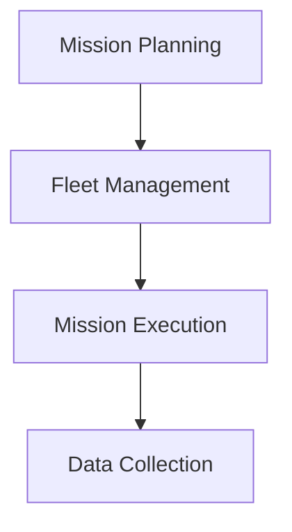

# 🚁 Advanced Drone Survey Management System

## 🎯 Overview

A comprehensive **React-based Drone Survey Management System** enabling efficient planning, execution, and monitoring of automated drone survey missions. The system provides a seamless interface for managing drone fleets, planning survey missions, and real-time mission monitoring.

---

## 🌟 Key Features

### 📍 Mission Planning

- Interactive map-based survey area selection
- Multiple survey patterns (Grid, Spiral)
- Automated waypoint generation
- Real-time flight parameter calculations
- Dynamic mission parameters
- Overlap percentage control
- Altitude and speed settings

### 🛸 Fleet Management

- Real-time drone status monitoring
- Battery level tracking
- Maintenance scheduling
- Automated drone assignment
- Drone telemetry data
- Location tracking
- Flight history

### 📊 Mission Monitoring

- Live mission progress tracking
- Real-time status updates
- Mission cancellation capability
- Automated drone release
- Progress visualization
- Mission parameter display

---

## 💡 Why Choose This System?

- **Efficiency:** Automates complex mission planning and execution tasks.
- **Scalability:** Supports multi-drone operations and large-scale surveys.
- **Reliability:** Ensures safety with real-time monitoring and error handling.
- **Flexibility:** Modular design allows easy customization and feature addition.

---

## 🛠️ System Architecture

The system follows a modular architecture with clear separation of concerns:



### Key Components

#### 1. State Management with Zustand

```javascript
const useMissionStore = create((set, get) => ({
  missions: [],
  activeMission: null,
  // Mission management methods
}));

const useDroneStore = create((set, get) => ({
  drones: [],
  // Drone management methods
}));
```

#### 2. Data Persistence with IndexedDB

```javascript
const db = new Dexie("DroneSurveyDB");
db.version(1).stores({
  missions: "++id, name, status, createdAt",
  drones: "++id, name, status",
});
```

#### 3. Mission Processing

- Waypoint generation
- Flight path optimization
- Parameter validation
- Real-time updates

---

## ⚖️ Trade-offs Considered

### 1. State Management

| Solution | Pros                    | Cons               | Decision    |
| -------- | ----------------------- | ------------------ | ----------- |
| Zustand  | Lightweight, Simple API | Limited middleware | ✅ Chosen   |
| Redux    | Robust ecosystem        | Complex, Heavy     | ❌ Rejected |

### 2. Data Storage

| Solution     | Pros                           | Cons            | Decision    |
| ------------ | ------------------------------ | --------------- | ----------- |
| IndexedDB    | Large storage, Complex queries | Complex API     | ✅ Chosen   |
| LocalStorage | Simple API                     | Limited storage | ❌ Rejected |

### 3. Map Integration

| Solution    | Pros                     | Cons            | Decision    |
| ----------- | ------------------------ | --------------- | ----------- |
| Leaflet     | Lightweight, Open-source | Basic features  | ✅ Chosen   |
| Google Maps | Feature-rich             | Costly, API key | ❌ Rejected |

---

## 🛡️ Safety and Adaptability Strategy

### Safety Measures

1. **Mission Planning**

   - Pre-flight parameter validation
   - Survey area boundary checks
   - Mission duration calculations
   - Battery requirement estimation

2. **Fleet Management**

   - Real-time battery monitoring
   - Maintenance status tracking
   - Automated drone assignment
   - Status change validation

3. **Mission Execution**
   - Progress tracking
   - Status monitoring
   - Emergency cancellation
   - Automated drone release

### System Adaptability

1. **Modular Architecture**

   - Separate state stores
   - Reusable components
   - Configurable parameters

2. **Extensible Design**

   - Easy feature addition
   - Configurable mission types
   - Flexible drone management

3. **Error Handling**
   - Comprehensive error states
   - Fallback mechanisms
   - Data persistence
   - State recovery

---

## 🚀 Getting Started

### Prerequisites

- **Node.js** >= 14.0.0
- Modern web browser with WebGL support
- Minimum 8GB RAM recommended
- Internet connection for map data

### Installation

```bash
# Clone the repository
git clone https://github.com/yourusername/drone-survey-system.git

# Navigate to the project directory
cd drone-survey-system

# Install dependencies
npm install

# Start the development server
npm start
```

---

## 📱 Technology Stack


---

## 📈 Future Enhancements

- [ ] Multi-drone mission coordination
- [ ] Advanced survey patterns
- [ ] 3D mapping integration
- [ ] Enhanced telemetry visualization
- [ ] Mission simulation capabilities
- [ ] Weather integration
- [ ] Battery optimization algorithms
- [ ] Mission report generation

---

## 📂 Project Structure

```
src/
├── components/
│   ├── MissionPlanning/
│   ├── FleetManagement/
│   └── MissionMonitoring/
├── store/
│   ├── missionStore.js
│   └── droneStore.js
├── utils/
│   ├── missionUtils.js
│   └── droneUtils.js
└── App.js
```

---

## 🤝 Contributing

Contributions are welcome! Please read our contributing guidelines and submit pull requests to our repository.

---

## 📄 License

This project is licensed under the **MIT License** - see the [LICENSE](LICENSE) file for details.

---

<p align="center">
Made with ❤️ by Ashish
</p>
